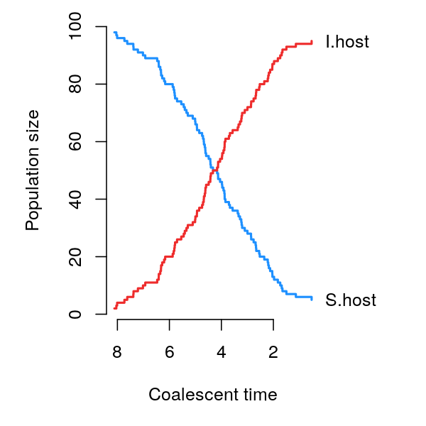
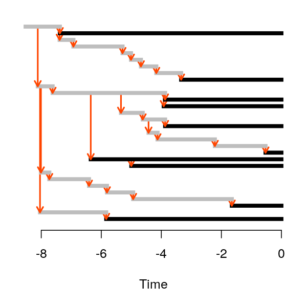
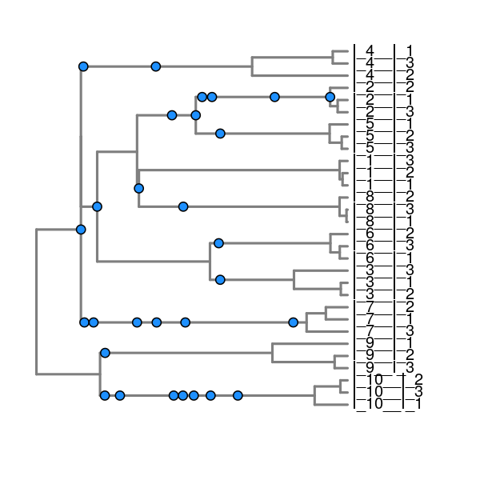

<!-- README.md is generated from README.Rmd. Please edit that file -->

# trees[within](http://github.com/PoonLab/twt)trees

**trees[within](http://github.com/PoonLab/twt)trees** (`twt`) is an R
package for the coalescent (reverse time) simulation of pathogen trees
within host transmission trees.

## Usage

This illustrates a basic use case of the `twt` package, where we
simulate the transmission (outer) tree and coalescent (inner) tree for
10 host individuals.

``` r
require(twt, quietly=TRUE)
#> 
#> Attaching package: 'ggfree'
#> The following object is masked from 'package:ape':
#> 
#>     unroot
# locate the YAML file that specifies a compartmental SI model
path <- system.file('extdata', 'SI.yaml', package='twt')
model <- Model$new(yaml.load_file(path))

# run an outer tree simulation
outer <- sim.outer.tree(model)
# display the population trajectories
plot(outer, type='s')
```



``` r
# display the outer tree, dark lines = sampled hosts, grey = unsampled
plot(outer)
```



``` r

# run an inner tree simulation
inner <- sim.inner.tree(outer)
# display the inner tree annotated with transmission events (points)
plot(inner)
```



## Installation

`twt` is an R package. It was developed and tested with R version 3.6+,
so you may encounter problems if you try running this package on much
older versions. It depends on the following R packages:

  - [R6](https://cran.r-project.org/web/packages/R6/index.html)
  - [ape](https://cran.r-project.org/web/packages/ape/index.html)
  - [yaml](https://cran.r-project.org/web/packages/yaml/index.html)
  - [ggfree](https://github.com/ArtPoon/ggfree)

`twt` can be installed from the GitHub repository using the `devtools`
package in R:

``` r
if (!require(devtools)) {
  # install devtools if not already present
  install.packages('devtools')
}
devtools::install_github("PoonLab/twt")
```

For detailed instructions, please refer to [INSTALL.md](INSTALL.md).

## Description

`twt` is an R package for discrete event simulation of nested
host-pathogen trees using a mixture of forward- and reverse-time
methods. Forward-time simulation is used to simulate the stochastic
growth and decline of host populations starting from an [index
case](https://en.wikipedia.org/wiki/Index_case). Next, a transmission
tree is simulated backwards in time from a number of individual hosts
that have been sampled from the population(s) (potentially at different
points in time). We refer to this tree as the *outer* tree. When this
sample size is substantially smaller than the entire population,
simulating backwards is far more efficient because we can ignore a
large number of unrelated hosts. Finally, `twt` simulates the *inner*
tree relating lineages that have been transmitted from host to another.

`twt` is designed to be modular and customizable so that it can
accommodate a range of models at different levels of diversity, such as:

  - [compartmental epidemic
    models](https://en.wikipedia.org/wiki/Compartmental_models_in_epidemiology),
    *e.g.,* susceptible-infected-recovered (SIR)
    models
  - [cospeciation](https://en.wikipedia.org/wiki/Cospeciation)/cophylogeny
    models
  - models of [compartmentalized within-host
    evolution](https://veg.github.io/hyphy-site/resources/compartmentalization_detection_ppt.pdf),
    *e.g.,* migration between the blood and genital tract

### Model specification
To be more versatile, `twt` requires users to specify a model using the
[YAML](https://en.wikipedia.org/wiki/YAML) markup language.
For instructions on writing your own YAML file for a custom model, please refer to 
our [wiki documentation](https://github.com/PoonLab/twt/wiki/Input-Specification) on this topic:
https://github.com/PoonLab/twt/wiki/Input-Specification

### Model structure
`twt` attempts to accommodate a variety of nested models with a common set of basic
components: [compartments](Compartment) and [lineages](Lineage). A
[lineage](Lineage) is a sequence of individual pathogens descending from
an ancestor in the past. A [compartment](Compartment) represents an
individual environment in which lineages are contained.
[Compartments](Compartment) are grouped into [Compartment
Types](CompartmentType) to make it more convenient to specify models and
for more efficient simulation. We assume that the compartments are
related through by a transmission or host tree, whose shape is
determined by the transmission rates among hosts. Lineages may also
migrate between compartments that are both hosts to other lineages.

### Discrete event simulation
Like many other simulation programs, twt uses a conventional [Gillespie
method](https://en.wikipedia.org/wiki/Gillespie_algorithm) to sample a
sequence of discrete stochastic events over reverse time. If a host tree
is not specified by the user, then the host/transmission tree is
simulated while simulating the coalescence of the pathogen lineages
within the hosts. Otherwise, the timing and direction of transmission
events are parsed from the user tree and set as [fixed events](Events)
in the simulation.

## Funding

Development of *treeswithintrees* was directly supported by a grant from
the Government of Canada through [Genome
Canada](https://www.genomecanada.ca/) and the [Ontario Genomics
Institute](https://www.ontariogenomics.ca/) (OGI-131) and by the
[Canadian Institutes of Health
Research](http://cihr-irsc.gc.ca/e/193.html) (project grant PJT-155990).
