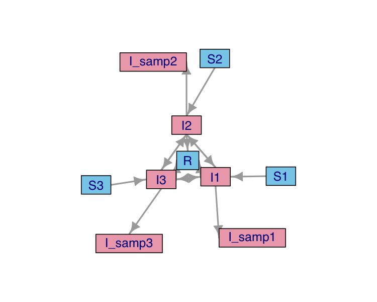
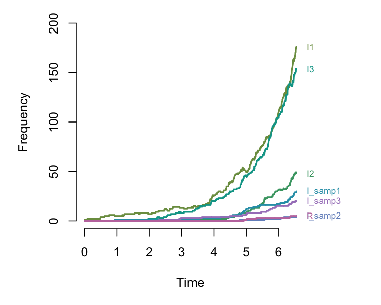
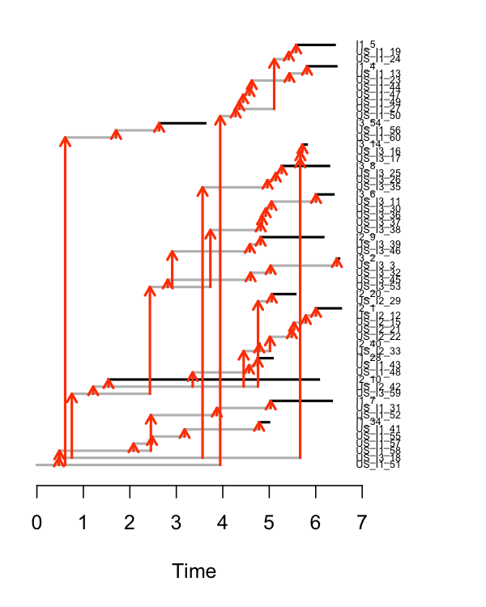
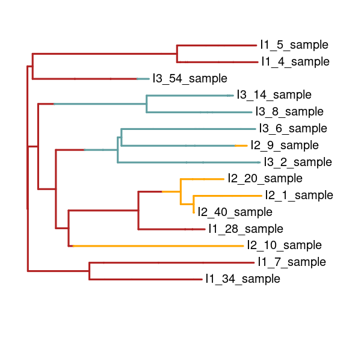
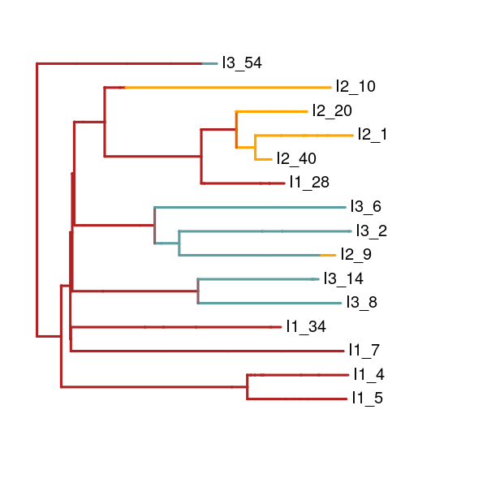
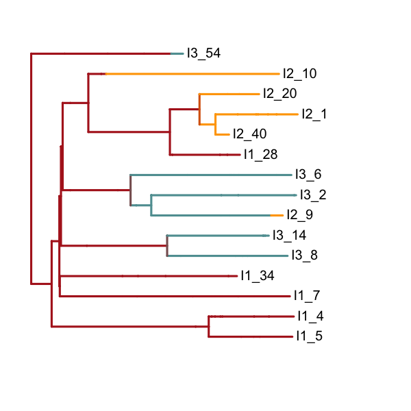

<!-- README.md is generated from README.Rmd. Please edit that file -->

# trees[within](http://github.com/PoonLab/twt)trees

**trees[within](http://github.com/PoonLab/twt)trees** (`twt`) is an R
package for running
[phylodynamic](https://en.wikipedia.org/wiki/Viral_phylodynamics)
simulations.

Specifically, **twt** uses exact stochastic simulation to generate
forward-time population dynamics under a [compartmental
model](https://en.wikipedia.org/wiki/Compartmental_models_(epidemiology)),
followed by the reverse-time simulation of a transmission history (outer
tree) given these dynamics, and a pathogen phylogeny (inner tree) nested
within that transmission history.

#### Features

- Use R expressions to specify rates; for example:
  - Constant expressions like `0.1` or `beta*S*I`
  - Probability distributions like `1+rpois(1,0.5)` for stochastic
    transmission bottlenecks
  - Time-varying rates like `beta0*(1+beta1*cos(w*t))` for periodic
    variation in transmission rates.
- Several built-in functions for visualizing your results.
- Accessible simulation outputs: All events are recorded in data frames
  for visualization and analysis.
- Your model can have repeated infections of the same host
  (superinfection), which induce discordant inner trees.
- Easy to install and use: **twt** is implemented exclusively in R.

### Installation

If you have already installed the R package
[`devtools`]((https://cran.r-project.org/web/packages/devtools/index.html)),
then the easiest method for installing this package is:

``` r
require(devtools)
devtools::install_github("ArtPoon/ggfree")
devtools::install_github("PoonLab/twt")
```

If you do not have `devtools` and you don’t want to install it (because
it has a large number of package dependencies), here is an alternative
method:

1.  `ape` and `igraph` are both CRAN-hosted packages that can be
    installed within R:

``` r
install.packages('ape', 'igraph')
```

2.  `ggfree` is not hosted on CRAN so you need to download a release or
    clone the repository with `git`.

``` bash
git clone https://github.com/ArtPoon/ggfree.git
R CMD INSTALL ggfree
```

3.  Finally, install `twt` using the same method:

``` bash
git clone https://github.com/PoonLab/twt.git
R CMD INSTALL twt
```

The `R CMD INSTALL` commands can be run as `sudo` if you want the
package to be available for all users.

### Usage

If you are in a hurry, you can use
[pipes](https://stat.ethz.ch/R-manual/R-devel/library/base/html/pipeOp.html)
to quickly generate a tree in one line:

``` r
require(twt)
phy <- Model$new(read_yaml("examples/SIR_serial.yaml")) |> sim.dynamics() 
       |> sim.outer.tree() |> sim.inner.tree() |> as.phylo()
```

However, you may want to generate replicate simulations at different
stages of this simulation, or visualize the outputs.

The following is a step-by-step **twt** workflow under an [SIR
model](https://en.wikipedia.org/wiki/Compartmental_models_(epidemiology)#SIR_model)
with serial sampling and three demes.

**twt** uses the [YAML](https://en.wikipedia.org/wiki/YAML) markup
language to specify a model:

``` r
require(twt, quietly = TRUE)
settings <- read_yaml("examples/migration.yaml")
```

This model specification (which is now a `list` object in R) is used to
create a Model object that can be visualized as a network, which is a
convenient means of troubleshooting your model:

``` r
mod <- Model$new(settings)
plot(mod)
```



Next, we simulate the population dynamics from this model forward in
time. The results can be visualized with a call to the generic `plot`
method:

``` r
dynamics <- sim.dynamics(mod)
plot(dynamics, ylim=c(0, 200))
```



To simulate an “outer” transmission tree, we pass the `Dynamics` object
to another function.

``` r
outer <- sim.outer.tree(dynamics)
```

As before, **twt** provides a generic plot function for visualizing the
simulation results. Each horizontal line segment in this plot represents
an infected host (grey if unsampled), and each vertical arrow represents
a transmission event:

``` r
plot(outer)
```



If you choose to stop at this point, you can convert the OuterTree
object to a phylogeny compatible with the R package `ape`, and exported
with `write.tree`:

``` r
phy <- as.phylo(outer)
plot(phy)
```



All simulated events are embedded in this `phylo` object, making it
easier to annotate the tree. In this example, we are colouring the
branches to indicate which compartment (deme) is occupied in the
transmission history:

``` r
L <- tree.layout(phy)
pal <- c(I1='firebrick', I2='orange', I3='cadetblue')
plot(L, type='n', mar=c(3,1,1,5))
lines(L, col=pal[L$edge$compartment], lwd=2)
```


Note we can change colours mid-branch because we know exactly when the
migrations occur.

To simulate an inner tree within the outer tree, we pass the `OuterTree`
object to another function. The resulting `InnerTree` object can also be
converted to an `ape::phylo` object for viewing and writing:

``` r
inner <- sim.inner.tree(outer)
L <- tree.layout(as.phylo(inner))
L$nodes$label <- L$nodes$host  # use Host labels instead of Pathogen
plot(L, type='n', label='t')
lines(L, col=pal[L$edge$compartment], lwd=2)
```



Because this particular model (`migration.yaml`) has incomplete
bottlenecks, we see some discordance between the inner and outer tree
topologies.

#### Funding

Development of *treeswithintrees* was supported by the Government of
Canada through [Genome Canada](https://www.genomecanada.ca/) and the
[Ontario Genomics Institute](https://www.ontariogenomics.ca/) (OGI-131),
and by the [Canadian Institutes of Health
Research](http://cihr-irsc.gc.ca/e/193.html) (PJT-155990).
