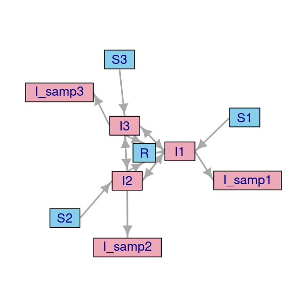
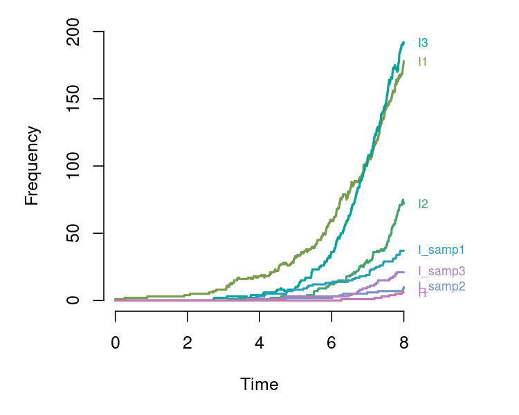

<!-- README.md is generated from README.Rmd. Please edit that file -->

# trees[within](http://github.com/PoonLab/twt)trees

**trees[within](http://github.com/PoonLab/twt)trees** (`twt`) is an R
package for running
[phylodynamic](https://en.wikipedia.org/wiki/Viral_phylodynamics)
simulations. Specifically, it uses exact stochastic simulation to
generate forward-time population dynamics under a compartmental model,
followed by the reverse-time simulation of a transmission history (outer
tree) given these dynamics, and a pathogen phylogeny (inner tree) nested
within that transmission history.

## Installation

**twt** is implemented exclusively in the R statistical computing
language. The recommended method to install this package is to download
a release or clone the repository, navigate to that directory and then
run the `INSTALL` command:

``` bash
git clone https://github.com/PoonLab/twt.git
cd twt
R CMD INSTALL .
```

The last command can be run as `sudo` if you want the package to be
available for all users.

Alternatively, you may use the
[devtools](https://cran.r-project.org/web/packages/devtools/index.html)
package to automate some of the above:

``` r
require(devtools)
devtools::install_github("PoonLab/twt")
```

## Usage

This illustrates a basic workflow under an [SIR
model](https://en.wikipedia.org/wiki/Compartmental_models_(epidemiology)#SIR_model)
with serial sampling and three demes.

**twt** uses the [YAML](https://en.wikipedia.org/wiki/YAML) markup
language to specify a model:

``` r
require(twt, quietly = TRUE)
settings <- read_yaml("examples/migration.yaml")
```

See below for an example of a YAML file.

This model specification (which is now a `list` object in R) is used to
create a Model object that can be visualized as a network, which is a
convenient means of troubleshooting your model:

``` r
mod <- Model$new(settings)
mod
#> twt Model
#>   Parameters:
#>      simTime :  10 
#>      beta :  0.001 
#>      gamma :  0.01 
#>      mig :  0.05 
#>      psi :  0.1 
#>   Compartments: S1  S2  S3  I1  I2  I3  I_samp1  I_samp2  I_samp3  R
plot(mod)
```



Next, we simulate the population dynamics from this model forward in
time. The results can be visualized with a call to the generic `plot`
method:

``` r
dynamics <- sim.dynamics(mod)
dynamics
#> twt Dynamics object
#>   Counted:  TRUE 
#>   662 events:
#>    migration transmission 
#>          147          515 
#>   Time range:  0.2622191 -> 7.996081
plot(dynamics, ylim=c(0, 200))
```



To simulate an “outer” transmission tree, we pass the `Dynamics` object
to another function.

``` r
outer <- sim.outer.tree(dynamics)
outer
#> twt OuterTree
#>   30 sampled Hosts
#>   1 active Hosts
#>   86 retired Hosts
#>   130 events in outer log:
#>    migration transmission 
#>           44           86
```

As before, **twt** provides a generic plot function for visualizing the
simulation results. Each horizontal line segment in this plot represents
an infected host (grey if unsampled), and each vertical arrow represents
a transmission event:

``` r
plot(outer)
```


If you choose to stop at this point, you can convert the OuterTree
object to a phylogeny that is compatible with the R package `ape`:

``` r
phy <- as.phylo(outer)
plot(phy)
```


All simulated events are embedded in this `phylo` object, making it
easier to annotate the tree:

``` r
L <- tree.layout(phy)
pal <- c(I1='firebrick', I2='orange', I3='cadetblue')
plot(L, type='n')
lines(L, col=pal[L$edge$compartment], lwd=2)
```


``` r

# 2) Reconstruct transmission tree (outer tree)
outer <- sim.outer.tree(mod, elog)

# Plot outer tree (raw)
plot(outer)

# Convert to phylo object
phy <- as.phylo(outer)

# Clean up single-child nodes (migration bookkeeping)
phy <- ape::collapse.singles(phy)

# Plot cleaned transmission tree
plot(phy)

# Export Newick tree
ape::write.tree(phy, file = "transmission_tree.nwk")
```

## Funding

Development of *treeswithintrees* was supported by the Government of
Canada through [Genome Canada](https://www.genomecanada.ca/) and the
[Ontario Genomics Institute](https://www.ontariogenomics.ca/) (OGI-131),
and by the [Canadian Institutes of Health
Research](http://cihr-irsc.gc.ca/e/193.html) (PJT-155990).
