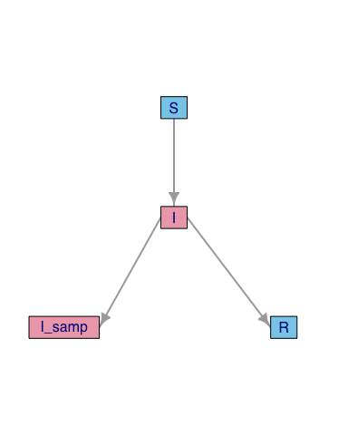

twt Model specification with YAML
================

- [A very brief introduction to
  YAML](#a-very-brief-introduction-to-yaml)
- [Parameters](#parameters)
- [Compartments](#compartments)
  - [Required fields](#required-fields)
  - [Outer rates](#outer-rates)
  - [Inner rates](#inner-rates)
- [Sampling](#sampling)
- [Models](#models)

### A very brief introduction to YAML

In **trees[within](https://github.com/PoonLab/twt)trees** (**twt**),
models are specified using a markup language called YAML. YAML is highly
readable plain-text file format that is commonly used for configuration
files. Key-value pairs are separated by a colon and space:

``` yaml
beta: 0.01
```

The value associated with a key may be a whole set of key-value pairs.
Indentation is used to indicate that these key-value pairs are
associated with the preceding key:

``` yaml
Parameters:
  simTime: 10.0
  beta: 0.01
```

We make use of this formatting to partition the YAML file into three
major components: (1) Parameters, (2) Compartments, and (3) Sampling.

One of the nice features of YAML is that it supports inline comments —
any text on the line following a `#` character is ignored by the YAML
parser:

``` yaml
  beta: 0.01  # this parameter is often used for transmission rates
```

Some examples of YAML files used to specify **twt** models are provided
in the `examples/` directory.

### Parameters

The Parameters block contains variable assignments:

``` yaml
Parameters:
  simTime:  10.0  # simulation time units before most recent sample date
  beta:  1e-4  # transmission rate
  gamma:  0.1  # clearance rate
  psi:  0.05  # sampling rate
```

**twt** creates a separate R environment for running simulations. Every
variable in the Parameters block is declared in that environment, making
them available for rate expressions in the Compartment block — the use
of expressions will be clarified in the next section.

The Parameters block also contains a special parameter, `simTime`.
`simTime` is used to specify the maximum length of a simulation. Hence,
it must be a positive number. This parameter *must* be declared in the
YAML file or **twt** will fail to create a Model object from it.

The time units of `simTime` are arbitrary, but all rates that are
declared in subsequent blocks operate on this time scale. For instance,
suppose that we assume `simTime` represents the number of years. An
exponential decay rate parameter `gamma` will have an expected waiting
time of `1/gamma` years per individual.

### Compartments

The Compartments block is where we declare each component of a
compartmental model. For example:

``` yaml
Compartments:
  S:
    infected: false
    transmission:
      I: {I: beta*S*I}  # S becomes I due to infection by member of I
    size: 9999  # initial
  I:
    infected: true
    migration:
      R: gamma*I
      I_samp: psi*I
    size: 1  # index case!
    bottleneck.size: 1  # define only for compartments that carry Pathogens
    coalescent.rate: 0.01
  I_samp:
    infected: true
    size: 0
  R:
    infected: false
    size: 0
```

Each Compartment has a unique name, which is denoted by a key in the
YAML file. For example, `S` typically represents the compartment of
susceptible, uninfected individuals.

#### Required fields

There are several key-value pairs that are declared under a Compartment
block. First, there are two required attributes:

- `infected` (`true`/`false`) indicates whether Hosts that are members
  of this Compartment are capable of carrying Pathogen lineages, *i.e.*,
  becoming infected.

- `size` (non-negative `integer`) gives the initial number of Hosts in
  the Compartment at simulation time zero.

#### Outer rates

Next, there are four types of events that can affect members of the
Compartment:

- `birth` defines the `rate` that new individual Hosts appear in
  Compartment `X`:

  ``` yaml
  X:
    birth: rate
  ```

  The placeholder `rate` can be any valid R expression. This `rate` may
  be density-dependent (*e.g.*, `lambda*X`) or density-independent
  (*e.g.*, `lambda`).

- `death` defines the `rate` that individual Hosts are removed from
  Compartment `X`:

  ``` yaml
  X:
    death: rate
  ```

  The placeholder `rate` can be any valid R expression. This `rate` may
  be density-dependent (*e.g.*, `mu*X`) or density-independent (*e.g.*,
  `mu`).

- `migration` define the rates that Hosts in compartment `X` migrate to
  compartment `Y` as key-value pairs. The key is the destination
  compartment, and the value is the associated rate:

  ``` yaml
  X:
    migration:
      Y: rate
  ```

  The placeholder `rate` can be any valid R expression. For example,
  `gamma*I` is the product of constant Parameter `gamma` and the current
  size of Compartment `I`.

- `transmission` is the most complicated field. It contains entries that
  take the following form:

  ``` yaml
  X:
    transmission:
      Y: {Z: rate}
  ```

  Given that this `transmission` block is declared under Compartment
  `X`, the above statement defines the `rate` that a member of `X` is
  moved to Compartment `Y` due to an interaction with a member of
  Compartment `Z`. This is an abstract way of talking about transmission
  in the context of a compartmental model, *i.e.*, `S+I -> I+I`.

  The placeholder `rate` can be any valid R expression that is normally
  a combination of Parameters and Compartment names. For example,
  `beta*S*I` is the product of constant Parameter `beta` and the current
  sizes of Compartments `S` and `I`.

  There may be multiple kinds of transmission events that move Hosts out
  of a Compartment. For example, suppose there are two risk groups `I1`
  and `I2` with different transmission rates, and that infection moves a
  Host from `S` (susceptible) to `E` (exposed) compartments. We can
  write:

  ``` yaml
  S:
    transmission:
      E: {I1: beta1*S*I1, I2: beta2*S*I2}
  ```

  *Technical note* - the following is an equivalent and valid YAML
  format:

  ``` yaml
  S:
    transmission:
      E:
        I1: beta1*S*I1
        I2: beta2*S*I2
  ```

  We prefer to switch to the curly-brace (inline block) syntax instead
  of introducing a third level of indented blocks, because it emphasizes
  the difference between the destination compartment (indented block)
  and the source compartment (inline block).

#### Inner rates

There are three rates that affect the dynamics and evolution of Pathogen
lineages within a Host:

- `bottleneck.size` indicates the number of Pathogen lineages that are
  moved from one Host to another during a single transmission event.
  This defaults to `1`, but you can use any valid R expression that
  returns an integer value. For example, `1+rpois(1,0.5)` draws a random
  integer from a shifted Poisson distribution with a mean of 1.5 and
  variance of 0.5. This parameter applies to any transmission event,
  including superinfections.

- `coalescent.rate` determines the expected waiting time (in units of
  simulation time) until two Pathogen lineages in the same Host converge
  to a common ancestor. This defaults to `Inf`, which causes coalescence
  between any pair of Pathogens within the same Host to be
  instantaneous.

- `pop.size` is the effective population size of the Pathogen population
  within a Host. This parameter determines the probability that one or
  more Pathogen lineages descend from lineages transmitted by a
  superinfection event. If not set by the user, this defaults
  arbitrarily to `100`.

### Sampling

The Sampling block is used to declare how Hosts are sampled from the
population. Each tip (terminal node) of a transmission tree represents a
sampled Host individual. There are only two keywords defined for the
`Sampling` block:

- `mode` specifies the sampling method.
  - `compartment` indicates that one or more Compartments in the model
    correspond to sampled states. This is used for modeling serial
    sampling where Hosts migrate to a sampled Compartment at some rate
    over time. It also defines an alternate stopping condition - if the
    target number of Hosts has been sampled from every Compartment, then
    the simulation is halted before reaching `simTime`.
  - `fraction` indicates that a user-specified fraction of the specified
    Compartments are sampled at random at the end of the simulation,
    *i.e.*, at `simTime`. (WORK IN PROGRESS)
- `targets` specifies the number of Hosts to sample from each
  Compartment.

For example:

``` yaml
Sampling:
  mode: compartment
  targets:
    I_samp: 10
```

indicates that the simulation is halted when 10 Hosts have migrated into
the `I_samp` Compartment.

## Models

A model specification is imported from a YAML file into R as a `List`.

``` r
> require(twt)
> settings <- read_yaml("examples/SIR_serial.yaml")
> summary(settings)
             Length Class  Mode
Parameters   4      -none- list
Compartments 4      -none- list
Sampling     2      -none- list
```

To convert this list into a Model object, we use the following command:

``` r
> mod <- Model$new(settings)
```

`Model` is an [R6](https://r6.r-lib.org/index.html) object class.
`Model$new()` calls the class constructor method that returns an
instance of this class. We can view all methods and attributes of this
object class by calling `str()`:

``` r
> str(mod)
Classes 'Model', 'R6' <Model>
  Public:
    clone: function (deep = FALSE) 
    get.birth.rates: function () 
    get.bottleneck.size: function (cname = NA) 

# .... output truncated ....

    parameters: list
    pop.sizes: 100 100 100 100
    sampling: list
    transmission.rates: 0 0 0 0 0 0 0 0 0 0 0 0 0 0 0 0 0 0 0 0 beta*S*I 0 0 0 0 ... 
```

Normally you can display this output by calling the object itself, but
we have overridden the `print` method to give a more concise display:

``` r
> mod  # calls generic print() method
twt Model
  Parameters:
     simTime :  10 
     beta :  1e-4 
     gamma :  0.1 
     psi :  0.05 
  Compartments: S  I  I_samp  R  
```

`Model` is an immutable object. In other words, it is not possible to
alter any of the parameter settings after creating the object. This
prevents the user from changing parameter values after running a
simulation, which can lead to mistakes when interpreting the results.

Calling `plot` on a Model object displays a graph that represents the
compartmental model - this can provide a quick way of troubleshooting
the specification of more complex models:

``` r
> plot(mod)
```



You can extract this graph to visualize with your preferred method, such
as
[network](https://cran.r-project.org/web/packages/network/refman/network.html#plot.network.default)
or [ggraph](https://cran.r-project.org/web/packages/ggraph/index.html):

``` r
> g <- mod$get.graph()
> g
IGRAPH 13d226d DN-- 4 3 -- 
+ attr: name (v/c)
+ edges from 13d226d (vertex names):
[1] S->I      I->I_samp I->R     
```
