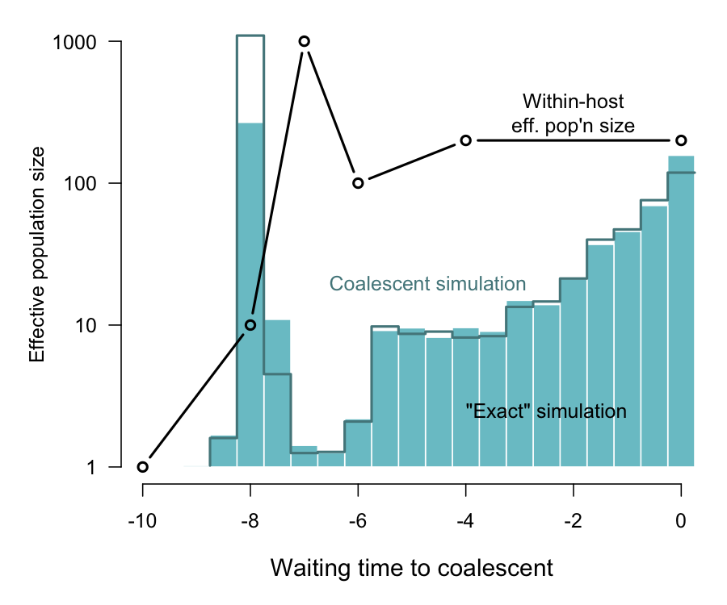

```{r setup, include=FALSE}
knitr::opts_chunk$set(echo = FALSE)
```


## *treeswithintrees*: an R package for exact discrete-event simulation of virus phylogenies

**Garway T Ng and Art Poon**  
Western University, Canada
Department of Pathology and Laboratory Medicine


## Phylodynamics and simulation

* [Phylodynamics](https://journals.plos.org/ploscompbiol/article?id=10.1371/journal.pcbi.1002947) is the reconstruction of epidemiological and immunological processes from the shape of the virus phylogeny.

* Simulation is an important technique to:
  * quickly characterize a model
  * validate methods to fit a model to data
  * fit a model with likelihood-free methods


## State of the art

* Several programs that enable the user to simulate trees under customized dynamic models.
  * [phydynR](https://github.com/emvolz-phylodynamics/phydynR) uses coalescent simulation given deterministic solution of dynamic system.
  * [phylodyn](https://github.com/mdkarcher/phylodyn) simulates coalescent trees under arbitrary effective population size trends.
  * [MASTER](http://tgvaughan.github.io/MASTER/) provides a flexible language for the forward discrete-event simulation of models.
  * [TreeModelAdequacy](https://github.com/sebastianduchene/tree_model_adequacy) uses simulation to assess whether a phylodynamic model can reproduce features of the data.


## Unmet needs

* Issues with approximate numerical solution of phylodynamic models as systems of differential equations. 
* Exploring stochastic dynamics of systems (deterministic solutions too limited).
* More flexible model specification: *e.g.*, arbitrary coalescent rate variation within hosts; variation in host attributes over time.
* A more feature-rich visualization toolkit.


## Proposed workflow

* Forward-time simulation of compartmental dynamics:
  * transmission - movement of virus to uninfected host
  * migration - movement of virus to infected host (superinfection)
  * transition - a given host changes between states
  
* Reverse-time simulation of (outer) transmission tree relating sampled hosts
* Coalescent simulation of (inner) virus phylogeny 

## Object classes

* `Model`
  * `CompartmentType` - *e.g.*, susceptible hosts
  * `Compartment` - individual instances of a given `CompartmentType`
  * `Lineage` - a sampled lineage of the virus tree
* `Run` - derived class of `Model` that contains outer tree
* `EventLogger` - data frame of both outer and inner tree events


## Model specification with YAML

```yaml
InitialConditions:
  originTime: 10.0  # time frame of simulation
  size:
    host: 100  # number of hosts
  indexType: 'host'
CompartmentTypes:
  'host':
    branching.rates: (host=0.01)  # transmission rate
    migration.rates: ()  ## not in use
    transition.rates: ()  ## not in use
    effective.size: 100.0  # of virus pop'n within host
    generation.time: 0.01
    bottleneck.size: 1  # on either transmission or migration
Compartments:
  'I':
    type: host
    replicates: 10  # number of sampled hosts
Lineages:
  'I':
    type: 'virus'
    sampling.time: 0  # this can be varied per Lineage
    location: I
    replicates: 3  # per sampled host
```


## Example

* SI model with 2 host types - 10 hosts sampled from a population of 100

```{r echo=TRUE, message=FALSE}
require(twt)
path <- system.file('extdata', 'structSI.yaml', package='twt')
mod <- Model$new(yaml.load_file(path)); mod
```


## Outer tree
```{r echo=TRUE, fig.width=10, fig.height=5}
set.seed(1); run <- sim.outer.tree(mod)
par(mfrow=c(1,2)); plot(run, 's'); plot(run)
```

## Time heterogeneity

#```{r echo=T, fig.width=9, fig.height=4.5}
#m2 <- Model$new(yaml.load_file('../tests/testthat/epoch.yaml'))
#set.seed(1); run2 <- sim.outer.tree(m2)
#par(mfrow=c(1,2)); plot(run2, 's', mar=c(5,5,0,2)); abline(v=3, lty=2, lwd=2); plot(run2, segments.lwd=3)
#```


## Resolving within-host events

* Coalescent rate $\propto$ 1 / eff. population size
* Force coalescence to type-specific bottleneck size ($n$) at infection time of host.
* Number of sampled lineages ($k$) following migration event to another host:
$$P(k)= {K\choose k} {N-K\choose n-k} \Big/ { N\choose n }$$
  
  where $N$ = eff. pop. size and $K$ = num. extant lineages.


## Piece-wise linear coalescent model



## Inner tree
```{r echo=TRUE, fig.height=4.5, fig.width=6}
set.seed(3); eventlog <- sim.inner.tree(run)
plot(eventlog, cex.lab=0.6)
par(xpd=NA); legend(x=0, y=0, legend=c('transmission', 'migration'), pch=c(16, 21), bg=c(NA, 'white'), horiz=T); text(x=9, y=52, label='Default labels {Compartment}__{Lineage}, where I1_4 is 4th Compartment of type I1', cex=0.8); par(xpd=FALSE)
```


## Colouring inner tree by host type
```{r echo=TRUE, fig.height=4.5, fig.width=6}
L <- tree.layout(as.phylo(eventlog, transmissions=T, migrations=T))
plot(L, type='n', cex.lab=0.5); lines(L, col=ifelse(grepl("host1|I1", L$edges$compartment1), 'blue', 'red'), lwd=1.5)
```


## Computing time

* 10 replicate simulations (on a lame 2013 iMac) under SI model, with 3 lineages per sampled host
```{r fig.height=5, fig.width=10}

x <- c(10, 50, 100, 200, 300, 500)
y <- c(10.691, 17.636, 34.294, 93.058, 192.254, 626.171) / 10

par(mar=c(5,5,2,1), mfrow=c(1,2))

plot(x,y, type='l', col='cadetblue', xlab='Number of sampled hosts', ylab='Average time per tree (seconds)', lwd=2, cex.lab=1.2)
title(main="Host population 1000", adj=0, font.main=1, cex=1)
points(x, y, pch=21, col='cadetblue', bg='white', lwd=2.5, cex=1.5)

x <- c(100, 200, 500, 1000, 2000, 5000, 7500, 1e4)
y <- c(2.118, 2.858, 5.631, 10.691, 19.551, 45.405, 69.069, 107.805)
plot(x, y, type='l', col='salmon', xlab='Host population size', ylab='Average time per tree (seconds)', lwd=2, cex.lab=1.2)
title(main="10 sampled hosts", adj=0, font.main=1, cex=1)
points(x, y, pch=21, col='salmon', bg='white', lwd=2.5, cex=1.5)
```


## Availability

* http://github.com/PoonLab/twt
* Released under [GNU Affero General Public License 3.0](https://www.gnu.org/licenses/agpl-3.0.en.html)
* Earlier documentation as wiki being transferred to [RMarkdown](https://rmarkdown.rstudio.com/) vignettes (like this presentation).


## Acknowledgements

* Early implementations by Garway (Tammy) Ng


* Development was supported the Government of Canada through [Genome Canada](https://www.genomecanada.ca/) and the [Ontario Genomics Institute](https://www.ontariogenomics.ca/) (OGI-131), and from the [Canadian Institutes for Health Research](https://cihr-irsc.gc.ca/e/193.html) (PJT-155990).


